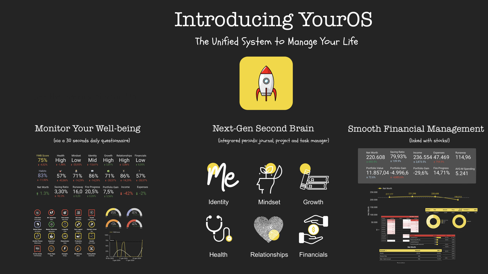

# YourOS — Personal Knowledge and Life Management System (2023–2025)

> **Project status: no longer actively maintained (since 2025).**
> This repository is preserved as a public archive. Since its launch in 2023,
> YourOS has been downloaded roughly **~1.5k times per year**. The system is
> provided as-is, free of charge, for anyone who finds it useful.

YourOS is a comprehensive personal knowledge and life management system designed
to help individuals organize and optimize their daily lives. The system is built
on Google Looker and Obsidian.md.

YourOS consists of four integrated components:

1. **Knowledge management** structured into the six core dimensions of our life —
   Health, Mindset, Identity, Financials, Relationships, and Growth. Each
   dimension can have linked projects, areas of responsibility, resources, and an
   archive. People familiar with personal knowledge management systems will
   recognize the [PARA Method](https://fortelabs.com/blog/para/).
2. A **journaling system** with periodic reviews (weekly, monthly, quarterly,
   annual) and an integrated well-being analytics system (dashboards).
3. A **task manager** and project/goals tracker.
4. A **financial tracker** system.

## Downloads

The packages are published as release assets:

- **[YourOS Full](https://github.com/adrianofontanari/YourOS/releases/latest/download/YourOS-Full.zip)** —
  the complete Obsidian vault, handbook (PDF), and video guides.
- **[YourOS Analytics](https://github.com/adrianofontanari/YourOS/releases/latest/download/YourOS-Analytics.zip)** —
  the Looker / Google Sheets / Google Forms analytics setup with video and written guides.

The unpacked contents of both packages are also browsable in
[`downloads/`](downloads/).

## Documentation

The handbook is available as browsable Markdown in
[`docs/handbook/`](docs/handbook/) (or as a PDF inside the Full download).

## Repository contents

| Path | Description |
| --- | --- |
| [`site/`](site/) | Static website (`youros.adrianofontanari.com`) |
| [`docs/handbook/`](docs/handbook/) | Handbook split into Markdown sections |
| [`downloads/`](downloads/) | Unpacked Full and Analytics packages |
| `Avatar/`, `Financials/` | Legacy YourOS embeddable widgets |

## Links

- Website: https://youros.adrianofontanari.com
- Product Hunt: https://www.producthunt.com/posts/youros

## License

YourOS is offered for free. Copyright © Adriano Fontanari.
