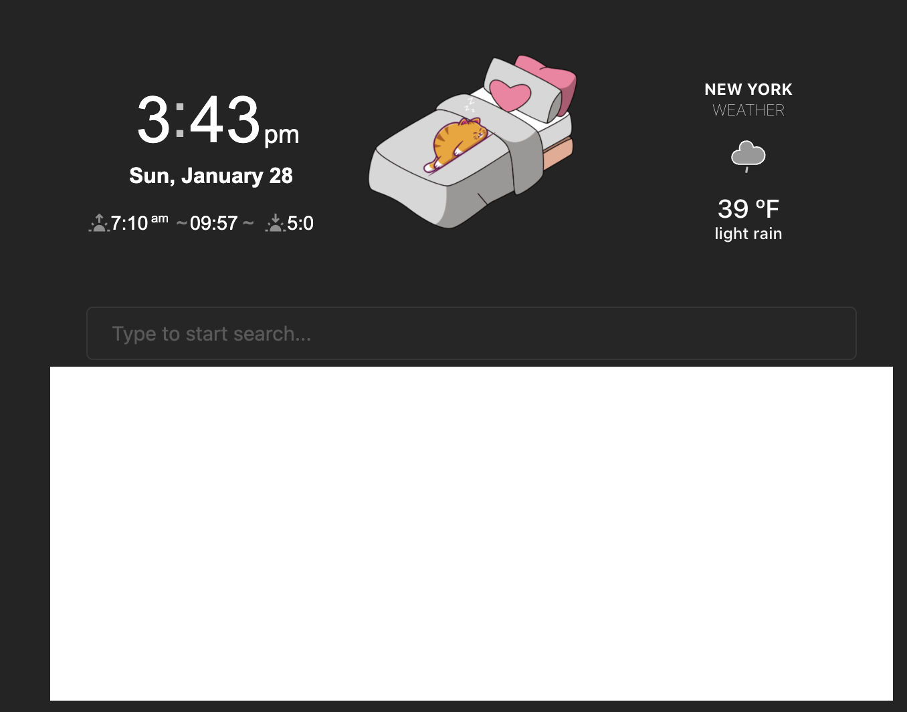

# YourOS Foundations

## YourOS Foundations

YourOS consists of four integrated components:
1) A knowledge management system structured into the six core dimensions of our life: Health, Mindset, Identity, Financials, Relationships, and Growth. each dimension can have linked projects, areas of responsibilities, resources, and an archive. People familiar with personal knowledge management systems will recall the PARA Method (https://fortelabs.com/blog/para/).
2) A Journaling system with periodic reviews (weekly, monthly, quarterly, annual) and a well-being analytics system (dashboards)
3) A task manager and project/goals tracker (note: the system aims to be a practical tool so there is no distinction between project/goals.)
4) A financial tracker system

In the video YourOS Essentials, I provide an overview of the components.

### Where to Start: Set up YourOS

On Setting the Right Expectations: **Configuring YourOS will around 30-45 minutes**, while taking advantage of all the pages included in the system may take a few weeks.

Note: At the startup, it is normal to see a blank space on some pages. These boxes are meant to include the YourOS Dashboards. If blank, it means a URL is missing. Please follow the YourOS Configuration in this handbook and the Configuration Video.

**If you are using Obsidian already**, I would suggest:
- Opening the YourOS Vault start using it and slowly move your files to the vault. Make sure to Trust the author and enable plugin from the pop-up message*
- Follow the steps included below

**If you are new to Obsidian** I would recommend:
	- i. checking a beginner's guide (e.g. https://obsidian.rocks/getting-started-with-obsidian-a-beginners-guide/) before using YourOS to get familiarity with the tool.
	- To Open the YourOS Vault follow the steps included in this [guide](https://help.obsidian.md/Files+and+folders/Manage+vaults#:~:text=On%20your%20computer%2C%20open%20Obsidian.,-At%20the%20bottom&text=At%20the%20right%20of%20Open,Click%20Open.)
	- Afterward, I would recommend watching the YourOS Essential and YourOS Configuration Videos
	- Finally, I would follow the steps included below.

---
*Note: these are solely used open-source plugins developed by the amazing Obsidian community and are necessary to make YourOS work properly. Enablgin 3rd plugins may also expose your notes in case plugins are malignant, this topic is part of a broad discussion around community plugins and cybersecurity). To the best of my knowledge, no issues have ever been found. I decline any responsibility for any malignant plugin. My suggestion is to always inspect the code on Git Hub and download the most downloaded plugins as they are more overseen. You can find more information on the security of the 3rd party plugins on this website https://obsidianaddict.com/. Disabling or uninstalling the plugin may alter how yours works-

----

After Opening the Vault here are the steps I would recommend following (in this order):

- Configure the Dashboards (see next below)
- Define Your Life Principles: Different are the facets of our life, one is our Life manifesto: a written statement outlining your aspirations and desires in life. Before getting into each area, I would recommend having this self-reflection exercise, by writing a life manifesto including the life principles. These are the underlying driving forces of our aspirations and motivations. Ray Dalio's books can be a good starting point for this step. Finally, add these to the [[Quotebook]] and they will appear in the daily journal.
- Set up your project goals from the command palette > Add New Project
- If you would like to use the embedded task manager: define the weekly priorities (should refer to the projects) in the Today Note and add the task from the command palled add task or manually  the this this week note
- Create a diary journal page start adding a few entries and compile the wellbeing survey. Note: you can change the location of the map by editing the latitude and longitude in the journal template note
- Explore other areas of YourOS: See Video
- Mobile Configuration: 
	- When you add a new note you can add an inbox tag to see them in 🪴 Today.
	- on iOS, you can add the dashboards and surveys to the home screen by accessing them via Safari, clicking on the share button, and selecting the Add to Home screen option from the contextual menu.

YourOS comes with pre-configured shortcuts to perform key actions:
- Command + P: Open Command Palette
- Command + O: Open Quick Switcher
- Command + E: Add New Diary Entry (To the Daily Journal Page)
- Command + T: Add a new Task (to the This Week Page)
- Command + N: Create a New Note
